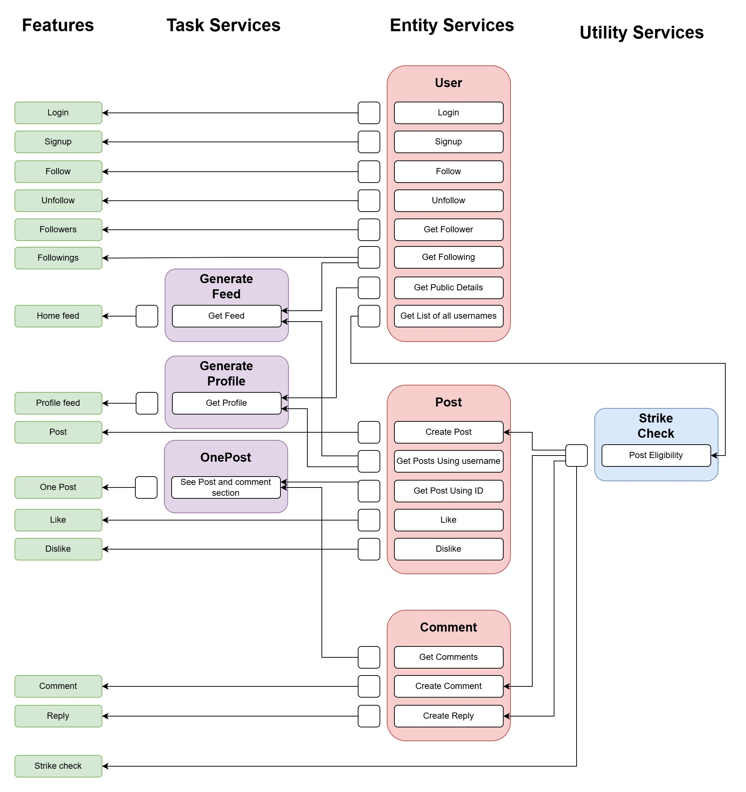

# LifeVoy
## Subtitle
An web service based backend server for a twitter-esque dummy software. 
## Features
1. New user can open a new account.
2. Old user can login.
3. User can post a post.
4. User can like a post.
5. User can dislike a post.
6. User can comment under a post.
7. User can reply under a comment.
8. User can see an individual post that will show the post and the comments and replies under it.
9. User can follow other users
10. User can unfollow other users
11. User can see a home feed that would show all the posts that have been made buy users they follow.
12. User can see a profile for any users where all the posts that user made along with their follower and following count will be shown
13. User can see who a user follows.
14. User can see who follows a user.
15. Each Post, Comment, Reply will be checked for strikable parts. If it contains that, user will receive a strike and the post/comment/reply will not be posted. after a certain number of strike, a user will be permanently banned from posting, commenting or replying.
16. Send Messages to other users
17. See previous messages with a user chronologically
18. See a list of all the conversation with the last message of each conversation. 
## Services
* **User**: Entity
* **Post**: Entity
* **Comment** : Entity
* **GenerateFeed** : Service
* **GenerateProfile** : Service
* **OnePost** : Service
* **StrikeChecker** : Utility
* **Messaging**: Entity
## Mapping Features to Operations and Interdependencies
The mentioned features are implemented through the following relationship between the services


##### Login
Service URL: http://localhost:8081/ws
XML Input :
```XML
<soapenv:Envelope xmlns:soapenv="http://schemas.xmlsoap.org/soap/envelope/" xmlns:user="http://fm.com/lifevoy/v2/user">
   <soapenv:Header/>
   <soapenv:Body>
      <user:LoginRequest>
         <user:username>username1</user:username>
         <user:password>password1</user:password>
      </user:LoginRequest>
   </soapenv:Body>
</soapenv:Envelope>
```

##### Signup
Service URL: http://localhost:8081/ws
XML Input :
```XML
<soapenv:Envelope xmlns:soapenv="http://schemas.xmlsoap.org/soap/envelope/" xmlns:user="http://fm.com/lifevoy/v2/user">
   <soapenv:Header/>
   <soapenv:Body>
      <user:SignupRequest>
         <user:username>username11</user:username>
         <user:password>password11</user:password>
      </user:SignupRequest>
   </soapenv:Body>
</soapenv:Envelope>
```

##### Follow
Service URL: http://localhost:8081/ws
XML Input :
```XML
<soapenv:Envelope xmlns:soapenv="http://schemas.xmlsoap.org/soap/envelope/" xmlns:user="http://fm.com/lifevoy/v2/user">
   <soapenv:Header/>
   <soapenv:Body>
      <user:FollowUserRequest>
         <user:requesterUsername>username3</user:requesterUsername>
         <user:targetUsername>username4</user:targetUsername>
      </user:FollowUserRequest>
   </soapenv:Body>
</soapenv:Envelope>
```
##### Unfollow
Service URL: http://localhost:8081/ws
XML Input :
```XML
<soapenv:Envelope xmlns:soapenv="http://schemas.xmlsoap.org/soap/envelope/" xmlns:user="http://fm.com/lifevoy/v2/user">
   <soapenv:Header/>
   <soapenv:Body>
      <user:UnfollowUserRequest>
         <user:requesterUsername>username1</user:requesterUsername>
         <user:targetUsername>username3</user:targetUsername>
      </user:UnfollowUserRequest>
   </soapenv:Body>
</soapenv:Envelope>
```
##### Get Followers
Service URL: http://localhost:8081/ws
XML Input :
```XML
<soapenv:Envelope xmlns:soapenv="http://schemas.xmlsoap.org/soap/envelope/" xmlns:user="http://fm.com/lifevoy/v2/user">
   <soapenv:Header/>
   <soapenv:Body>
      <user:GetFollowersRequest>
         <user:username>username3</user:username>
      </user:GetFollowersRequest>
   </soapenv:Body>
</soapenv:Envelope>
```
##### Get Followings
Service URL: http://localhost:8081/ws
XML Input :
```XML
<soapenv:Envelope xmlns:soapenv="http://schemas.xmlsoap.org/soap/envelope/" xmlns:user="http://fm.com/lifevoy/v2/user">
   <soapenv:Header/>
   <soapenv:Body>
      <user:GetFollowingsRequest>
         <user:username>username1</user:username>
      </user:GetFollowingsRequest>
   </soapenv:Body>
</soapenv:Envelope>
```
##### Home Feed
Service URL: http://localhost:8084/ws
XML Input :
```XML
<soapenv:Envelope xmlns:soapenv="http://schemas.xmlsoap.org/soap/envelope/" xmlns:feed="http://www.fm.com/lifevoy/v2/feed">
   <soapenv:Header/>
   <soapenv:Body>
      <feed:GetFeedRequest>
         <feed:username>username1</feed:username>
      </feed:GetFeedRequest>
   </soapenv:Body>
</soapenv:Envelope>
```
##### Profile Feed
Service URL: http://localhost:8085/ws
XML Input :
```XML
<soapenv:Envelope xmlns:soapenv="http://schemas.xmlsoap.org/soap/envelope/" xmlns:prof="http://www.fm.com/lifevoy/v2/profile">
   <soapenv:Header/>
   <soapenv:Body>
      <prof:GetProfileRequest>
         <prof:username>username3</prof:username>
      </prof:GetProfileRequest>
   </soapenv:Body>
</soapenv:Envelope>
```
##### Create Post
Service URL: http://localhost:8082/ws
XML Input :
```XML
<soapenv:Envelope xmlns:soapenv="http://schemas.xmlsoap.org/soap/envelope/" xmlns:post="http://fm.com/lifevoy/v2/post">
   <soapenv:Header/>
   <soapenv:Body>
      <post:CreatePostRequest>
         <post:posterUsername>username1</post:posterUsername>
         <post:text>shesher post</post:text>
      </post:CreatePostRequest>
   </soapenv:Body>
</soapenv:Envelope>
```
##### One Post with Comment Section
Service URL: http://localhost:8086/ws
XML Input :
```XML
<soapenv:Envelope xmlns:soapenv="http://schemas.xmlsoap.org/soap/envelope/" xmlns:onep="http://www.fm.com/lifevoy/v2/onepost">
   <soapenv:Header/>
   <soapenv:Body>
      <onep:GetOnePostRequest>
         <onep:postID>15</onep:postID>
      </onep:GetOnePostRequest>
   </soapenv:Body>
</soapenv:Envelope>
```
##### Like Post
Service URL: http://localhost:8082/ws
XML Input :
```XML
<soapenv:Envelope xmlns:soapenv="http://schemas.xmlsoap.org/soap/envelope/" xmlns:post="http://fm.com/lifevoy/v2/post">
   <soapenv:Header/>
   <soapenv:Body>
      <post:LikePostRequest>
         <post:postID>3</post:postID>
         <post:requesterUsername>username5</post:requesterUsername>
      </post:LikePostRequest>
   </soapenv:Body>
</soapenv:Envelope>
```
##### Dislike Post
Service URL: http://localhost:8082/ws
XML Input :
```XML
<soapenv:Envelope xmlns:soapenv="http://schemas.xmlsoap.org/soap/envelope/" xmlns:post="http://fm.com/lifevoy/v2/post">
   <soapenv:Header/>
   <soapenv:Body>
      <post:DislikePostRequest>
         <post:postID>3</post:postID>
         <post:requesterUsername>username3</post:requesterUsername>
      </post:DislikePostRequest>
   </soapenv:Body>
</soapenv:Envelope>
```
##### Comment under a Post
Service URL: http://localhost:8083/ws
XML Input :
```XML
<soapenv:Envelope xmlns:soapenv="http://schemas.xmlsoap.org/soap/envelope/" xmlns:com="http://fm.com/lifevoy/v2/comment">
   <soapenv:Header/>
   <soapenv:Body>
      <com:CommentRequest>
         <com:postID>11</com:postID>
         <com:username>username2</com:username>
         <com:text>lol</com:text>
      </com:CommentRequest>
   </soapenv:Body>
</soapenv:Envelope>
```
##### Reply under a Comment
Service URL: http://localhost:8083/ws
XML Input :
```XML
<soapenv:Envelope xmlns:soapenv="http://schemas.xmlsoap.org/soap/envelope/" xmlns:com="http://fm.com/lifevoy/v2/comment">
   <soapenv:Header/>
   <soapenv:Body>
      <com:ReplyRequest>
         <com:commentID>?</com:commentID>
         <com:username>?</com:username>
         <com:text>?</com:text>
      </com:ReplyRequest>
   </soapenv:Body>
</soapenv:Envelope>
```
##### Send a Message
Service URL: http://localhost:9000/ws
XML Input :
```XML
<soapenv:Envelope xmlns:soapenv="http://schemas.xmlsoap.org/soap/envelope/" xmlns:ser="http://service.messaing">
   <soapenv:Header/>
   <soapenv:Body>
      <ser:SendMessageRequest>
         <ser:sender>username1</ser:sender>
         <ser:receiver>username2</ser:receiver>
         <ser:text>fbmskafmb</ser:text>
      </ser:SendMessageRequest>
   </soapenv:Body>
</soapenv:Envelope>
```
##### See a particular Conversation
Service URL: http://localhost:9000/ws
XML Input :
```XML
<soapenv:Envelope xmlns:soapenv="http://schemas.xmlsoap.org/soap/envelope/" xmlns:ser="http://service.messaing">
   <soapenv:Header/>
   <soapenv:Body>
      <ser:GetChatLogRequest>
         <ser:chatID>3</ser:chatID>
      </ser:GetChatLogRequest>
   </soapenv:Body>
</soapenv:Envelope>
```
##### See a list of Conversations with last Message
Service URL: http://localhost:9000/ws
XML Input :
```XML
<soapenv:Envelope xmlns:soapenv="http://schemas.xmlsoap.org/soap/envelope/" xmlns:ser="http://service.messaing">
   <soapenv:Header/>
   <soapenv:Body>
      <ser:GetListOfChatsRequest>
         <ser:username>username1</ser:username>
      </ser:GetListOfChatsRequest>
   </soapenv:Body>
</soapenv:Envelope>
```
## Principles
#### User
The User Service is running in the 8081 port, whose wsdl file is available at: http://localhost:8081/ws/user.wsdl 
SoapUI Configuration File: [User Configuration](/SoapUI%20Configurations/LifeVoy-v2-User-soapui-project.xml) 


This service 
* has a standardized Service Contract in form of this wsdl file
* have reasonably loose coupling
* is reusable 
* is autonomous (doesnt have any dependencey)
* is stateless (each call is its own thing)
Abstraction wasnt possible due to the project being too simplistic in nature. Discoverability was out of scope. composability wasnt implemented due to time constrains.

#### Post
The Post Service is running in the 8082 port, whose wsdl file is available at: http://localhost:8082/ws/post.wsdl
SoapUI Configuration File: [Post Configuration](/SoapUI%20Configurations//Lifevoy-v2-Post-soapui-project.xml) 

This service 
* has a standardized Service Contract in form of this wsdl file
* is reusable 
* is autonomous (doesnt have any dependencey other than the utility service)
* is stateless (each call is its own thing)
The service was too central for it to have loose coupling. Abstraction wasnt possible due to the project being too simplistic in nature. Discoverability was out of scope. composability wasnt implemented due to time constrains.

#### Comment
The Comment Service is running in the 8083 port, whose wsdl file is available at: http://localhost:8083/ws/comment.wsdl
SoapUI Configuration File: [Comment Configuration](/SoapUI%20Configurations/Lifevoy-v2-Comment-soapui-project.xml) 

This service 
* has a standardized Service Contract in form of this wsdl file
* is reusable 
* have reasonably loose coupling
* is autonomous (doesnt have any dependencey other than the utility service)
* is stateless (each call is its own thing)
Abstraction wasnt possible due to the project being too simplistic in nature. Discoverability was out of scope. composability wasnt implemented due to time constrains.

#### Messaging
The Messaging Service is running in the 9000 port, whose wsdl file is available at: http://localhost:9000/ws/messaging.wsdl
SoapUI Configuration File: [Messaging Configuration](/SoapUI%20Configurations/LifeVoy-V2-Messaging-soapui-project.xml) 

This service 
* has a standardized Service Contract in form of this wsdl file
* is reusable 
* is completely decoupled
* is autonomous (doesnt have any dependencey at all)
* is stateless (each call is its own thing)
Abstraction wasnt possible due to the project being too simplistic in nature. Discoverability was out of scope. composability wasnt implemented due to time constrains.

#### Generate Feed
The GenerateFeed Service is running in the 8084 port, whose wsdl file is available at: http://localhost:8084/ws/feed.wsdl
SoapUI Configuration File: [Generate Feed Configuration](/SoapUI%20Configurations/Lifevoy-v2-Feed-soapui-project.xml) 

This service 
* has a standardized Service Contract in form of this wsdl file
* is stateless (each call is its own thing)
It isnt reusable due to being a task service and specific for a task. This is dependent on 2 entity services making it more coupled and less autonomous. Abstraction wasnt possible due to the project being too simplistic in nature. Discoverability was out of scope. composability wasnt implemented due to time constrains.

#### Generate Profile
The GenerateProfile Service is running in the 8085 port, whose wsdl file is available at: http://localhost:8085/ws/profile.wsdl
SoapUI Configuration File: [Profile Configuration](/SoapUI%20Configurations/LifeVoy-v2-Profile-soapui-project.xml) 

This service 
* has a standardized Service Contract in form of this wsdl file
* is stateless (each call is its own thing)
It isnt reusable due to being a task service and specific for a task. This is dependent on 2 entity services making it more coupled and less autonomous. Abstraction wasnt possible due to the project being too simplistic in nature. Discoverability was out of scope. composability wasnt implemented due to time constrains.

#### OnePost
The OnePost Service is running in the 8086 port, whose wsdl file is available at: http://localhost:8086/ws/onepost.wsdl
SoapUI Configuration File: [One Post Configuration](/SoapUI%20Configurations/LifeVoy-v2-OnePost-soapui-project.xml) 

This service 
* has a standardized Service Contract in form of this wsdl file
* is stateless (each call is its own thing)
It isnt reusable due to being a task service and specific for a task. This is dependent on 2 entity services making it more coupled and less autonomous. Abstraction wasnt possible due to the project being too simplistic in nature. Discoverability was out of scope. composability wasnt implemented due to time constrains.

#### Strike Checker
The StrikeCheck Service is running in the 8087 port, whose wsdl file is available at: http://localhost:8087/ws/strikecheck.wsdl
SoapUI Configuration File: [Strike Checker Configuration](/SoapUI%20Configurations/LifeVoy-v2-StrikeCheck-soapui-project.xml) 

This service 
* has a standardized Service Contract in form of this wsdl file
* is reusable 
* is completely decoupled
* is autonomous (doesnt have any dependencey at all)
* is stateless (each call is its own thing)
Abstraction wasnt possible due to the project being too simplistic in nature. Discoverability was out of scope. composability wasnt implemented due to time constrains.


