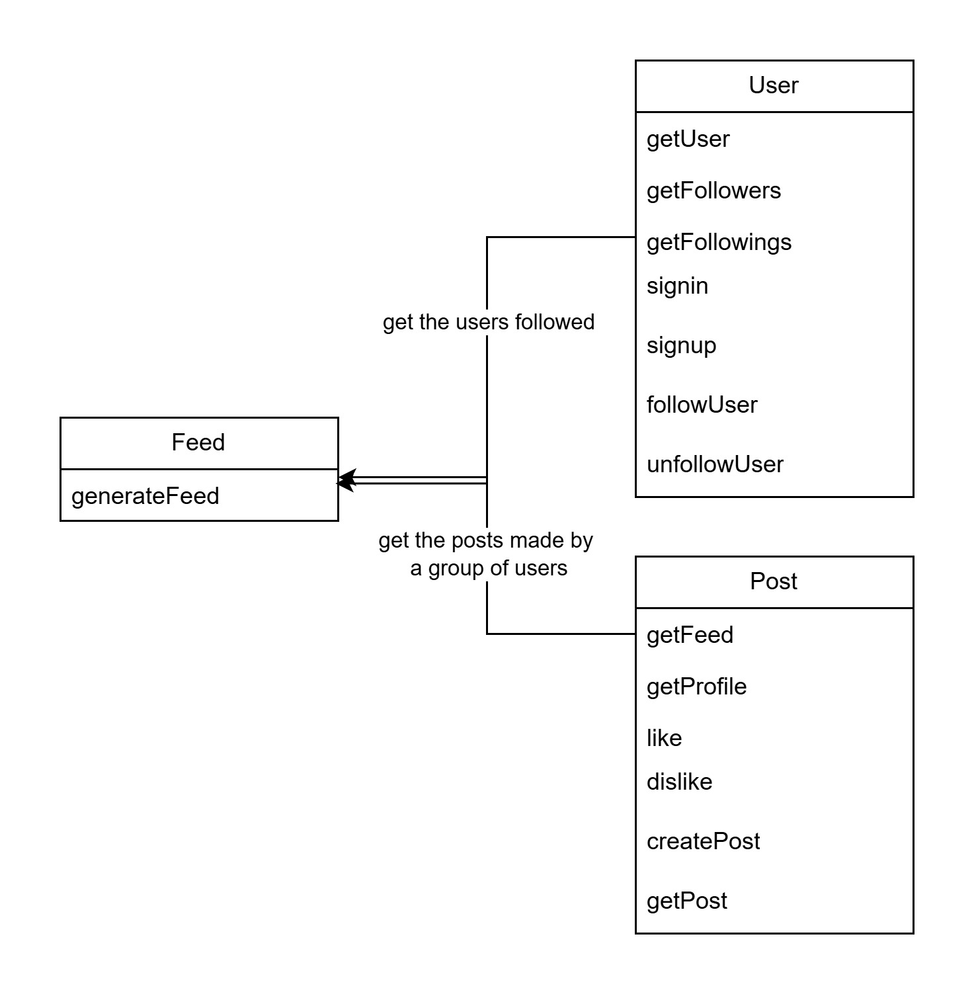
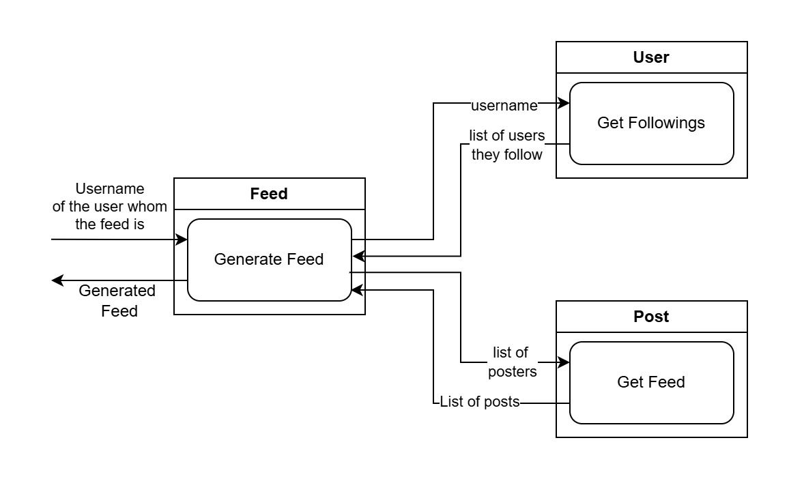

# LifeVoy

## Subtitle
An web service based backend server for a twitter-esque dummy software. 

## Description
Here an user of the app can do the following operations:
1. ***Signup*** for a new account
2. ***Sign In*** to the existing account
3. ***Follow*** another user
4. ***Unfollow*** User
5. See a ***Timeline Feed*** of posts made by the users they follow
6. See the ***Profile Feed*** of an specific user
7. ***Create Post***
8. ***Like*** a post
9. ***Dislike*** a post

These operations have been divided into 3 services.
1. **User Service** : an *Entity Service* that is concerned with management of the user account
2. **Post Service**: an *Entity Service* that is concerned with the management of post related operations
3. **Feed Service**: a *Task Service* that manages generating Timeline Feed for a user.

## Attachments
In this folder 3 maven spring boot project is available related to each of the services.

## Service Contracts
1. **User**: [user.wsdl](http://localhost:8301/ws/user.wsdl)
2. **Post**: [post.wsdl](http://localhost:8201/ws/post.wsdl)
3. **Feed**: [feed.wsdl](http://localhost:8101/ws/feed.wsdl)

## Relation between the services

Here the Feed consumes the services User and Post who also independent operations of their own. While generating Feed, the Feed service sends a request to the user service and receives the list of accounts the user follows through GetFollowing. After that, It parses the response and makes a list of all the usernames of those accounts. After that, It gets all the posts through getFeed call using these usernames. 

This relation can be seen in the following diagram:

## Internal Structure of the Services
Each service has the following essential components:

#### Schema
Schema contains the definitions of all the datatypes of the binding class.
#### Application properties
defines the port number and name of the application
#### Application Class
Contains the main function
#### "Generated" package
contains all the binding classes
#### Endpoint Class
defines each operation for a port type using the binding classes. It may call repository (dummy database) or client (consumer of other web services) according to its need.
#### Config Class
Makes a message dispatcher bean that is vital for all web services. makes a wsdl for the web service using the schema and endpoint class.

## Principles Followed
| principle        | User | Post | Feed |
| ---------------- | ---- | ---- | ---- |
| Service Contract | ✔️   | ✔️   | ✔️   |
| Loose Coupling   | ✔️   | ✔️   |      |
| Abstraction      | ✔️   | ✔️   | ✔️   |
| Reusability      | ✔️   | ✔️   |      |
| Autonomy         | ✔️   | ✔️   |      |
| Statelessness    | ✔️   | ✔️   | ✔️   |
| Discoverability  |      |      |      |
| Composability    | ✔️   | ✔️   | ✔️   |
